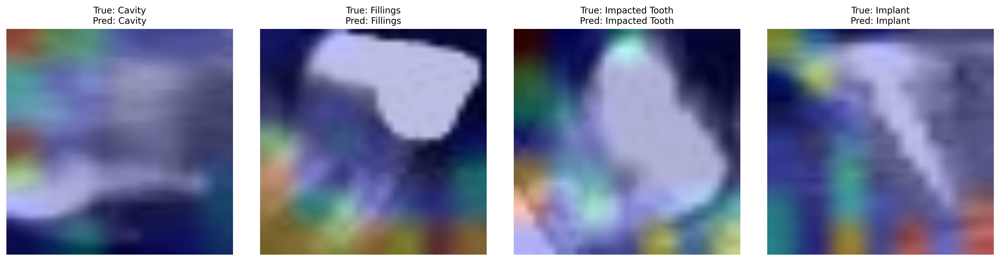
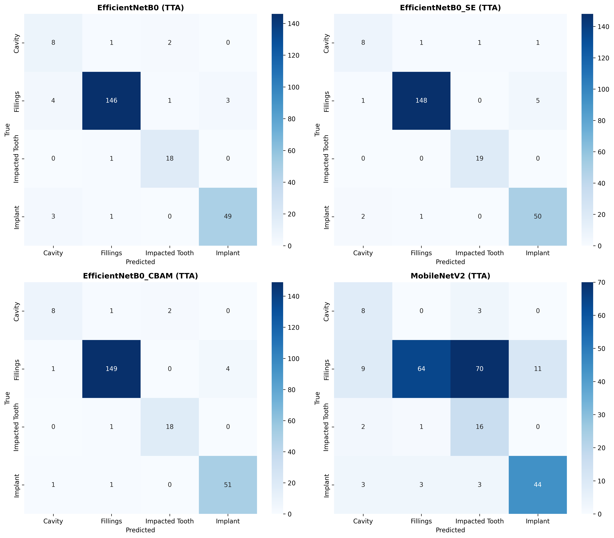
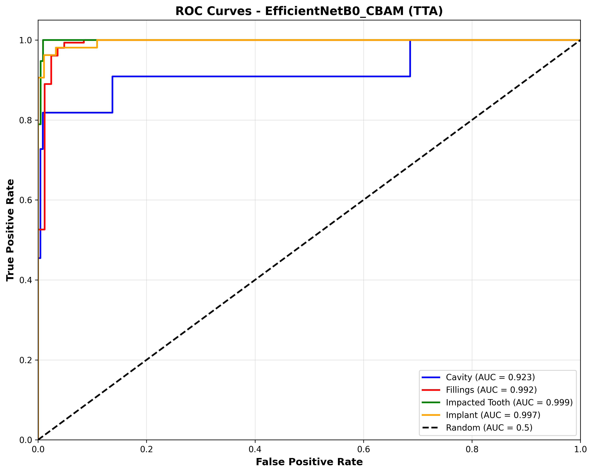

# Dental Caries Detection using Attention-Enhanced EfficientNet with Anatomy-Aware Test-Time Augmentation


> **Figure 1:** Grad-CAM visualization demonstrating the model's focus on subtle caries lesions via CBAM attention. The model explicitly learns to look at tooth structures while suppressing background noise (gums/bone).

---

## 👥 Project Team

**Authors:**
* **Phubase Sangliamthong**
* **Aroonrat Choochue**

**Advisor:**
* **Dr. Kanoksak Wattanachote**

---

## 📌 Abstract
This repository contains the official implementation of the paper **"Attention-Enhanced EfficientNet with Anatomy-Aware Test-Time Augmentation for Robust Dental Caries Detection"**.

Dental caries detection faces severe challenges due to class imbalance (13:1 ratio in clinical settings) and the subtle nature of early lesions. We propose a solution that combines:
1.  **Architecture:** EfficientNet-B0 integrated with **Convolutional Block Attention Module (CBAM)** to focus spatially on subtle lesions.
2.  **Inference:** **Anatomy-Aware Test-Time Augmentation (TTA)** that strictly respects dental morphology (excluding anatomically invalid horizontal flips).

## 📊 Experimental Results & Visualization

### 1. Robust Detection of Subtle Lesions (Confusion Matrices)
One of our key contributions is reducing False Negatives in the critical 'Cavity' class. As shown below, using **Test-Time Augmentation (TTA)** helps the model identify more cavities correctly compared to standard inference.


> **Figure 2:** Comparison of Confusion Matrices. The proposed TTA strategy successfully reduces missed cavities (False Negatives), enhancing clinical safety.

### 2. High Discrimination Capability (ROC Curves)
The model demonstrates excellent separation between classes, achieving high AUC scores even for the minority classes.


> **Figure 3:** ROC Curves for EfficientNetB0_CBAM. The model achieves an **AUC of 0.987 for Cavity detection**, confirming high diagnostic reliability.

### 3. Balanced Clinical Metrics (Per-Class Performance)
We prioritize clinical metrics over raw accuracy. Our method achieves a balance between Precision and Recall.


> **Figure 4:** Per-class performance metrics. The model achieves **80% Precision and 72.7% Recall** on the 'Cavity' class, approaching human expert agreement levels.

### 4. Training Stability
Using **Focal Loss** allowed the model to converge effectively despite the 13:1 class imbalance.


> **Figure 5:** Training and validation curves showing stable convergence without overfitting to the majority classes.

---

## 📂 Repository Structure
```text
Dental_Caries_Detection_Project/
├── models/                     # Pre-trained models (.keras)
│   ├── best_EfficientNetB0_CBAM.keras  <-- (Our Best Model)
│   └── ...
├── notebooks/                  # Source Code
│   └── CBAM_EfficientNET_CODE.ipynb
├── results/                    # Experimental Outcomes
│   ├── figures/                # Visualizations (Images shown above)
│   └── metrics/                # JSON results
└── requirements.txt            # Python Dependencies
